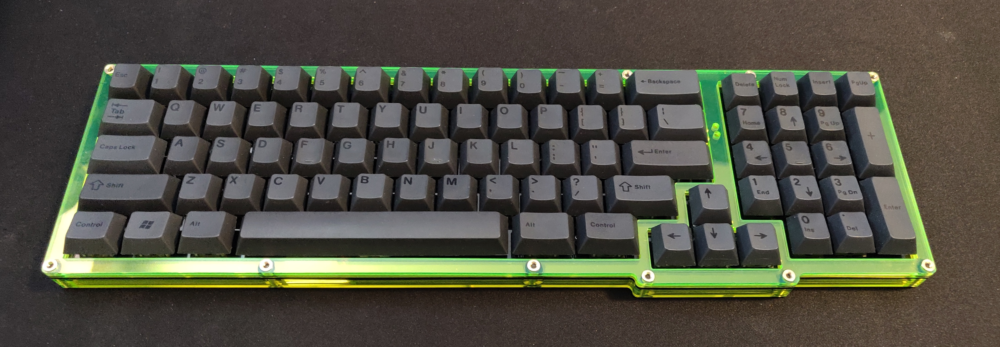

# Z18

## An 1800 Layout, ZMK-Powered BLE Keyboard with visible surface-mount components proudly displayed.

> :warning: **This is an untested project.** Do not use to create your own copy unless you are willing to debug the hardware and/or firmware.

## Flash bootloader

Bootloader is pre-loaded on assembled pcbs. If you source your own BLE module you will need to unlock the module and flash the bootloader using the Nordic nrf command line tool.

```
$ nrfjprog --recover --log
```

```
$ nrfjprog -f nrf52 --program firmware/bootloader/COBO_nrf52840_Z18_bootloader-0.3.2-184-g64ea299_s140_6.1.1
```

---

## Upload Firmware

- See ZMK docs for instructions on setting up ZMK and custimizing firmware.
  - https://zmkfirmware.dev/docs/user-setup/
  - https://zmkfirmware.dev/docs/customization
- Default \*.uf2 files are pre-loaded on assembled pcbs. If you sourced and assembled your own pcb, you can file deafult pre-built firmware here:
  - https://github.com/ericrlau/COBO-zmk-config/releases

## PCB

## ToDo

- redo matrix to fix two columns mapping to a single gpio, not sure why that happened. 
- rotate battery connector to provide clearance
- 

## Images

#### Prototype Build


